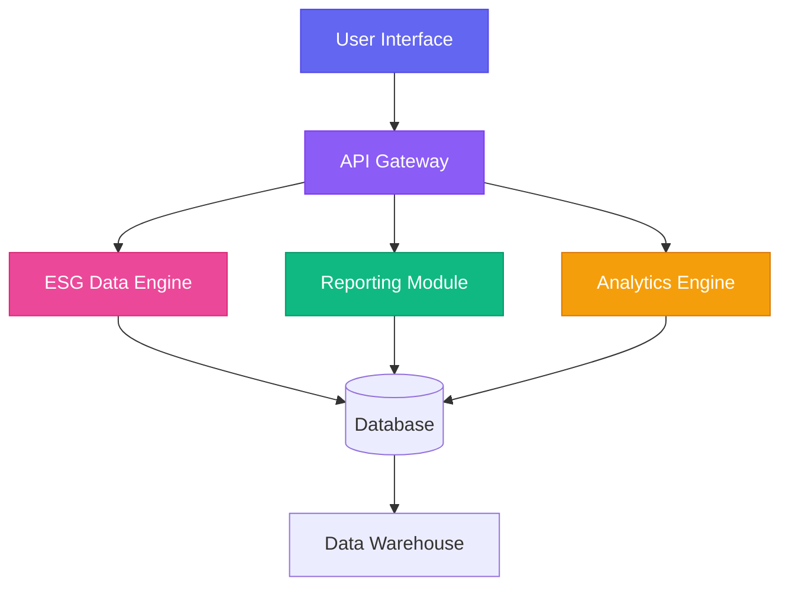

# 🌱 ESG Solutions Platform
<div align="center">


</div>

---

## 🎯 **What is ESG Solutions?**

> Transform your sustainability journey with our comprehensive ESG management platform

ESG Solutions is a cutting-edge **Environmental, Social, and Governance** platform designed to help organizations track, analyze, and report their sustainability performance with ease and precision.

<details>
<summary>🌟 <strong>Key Highlights</strong></summary>
<br>

- 📊 **Real-time ESG Data Tracking**
- 🎯 **BRSR & Global Standards Compliance**  
- 🔍 **Advanced Analytics & Benchmarking**
- 📈 **Predictive Climate Risk Assessment**
- 🏆 **Industry-leading Security Standards**

</details>

---

## 🚀 **Quick Start**

```bash
# Clone the repository
git clone https://github.com/your-org/esg-solutions.git

# Navigate to project
cd esg-solutions

# Install dependencies
npm install

# Start development server
npm run dev
```

<div align="center">
  
</div>

---

## ✨ **Features**

<table>
<tr>
<td width="50%">

### 📊 **Data Management**
- ✅ ESG Data Collection & Tracking
- ✅ DEFRA & Custom Emission Factors
- ✅ GHG Accounting (Scope 1, 2 & 3)
- ✅ Built-in Audit Functions

</td>
<td width="50%">

### 📈 **Reporting & Analytics**
- ✅ BRSR, SASB, CDP, TCFD Reports
- ✅ Predictive Analytics
- ✅ Climate Change Dashboard
- ✅ Peer Benchmarking

</td>
</tr>
<tr>
<td width="50%">

### 🎯 **Assessment Tools**
- ✅ Industry-Specific Gap Analysis
- ✅ Risk & Opportunity Mapping
- ✅ Global Standards Alignment
- ✅ ESG Transparency Scoring

</td>
<td width="50%">

### 🔒 **Security & Compliance**
- ✅ SOC 2 Type II Certified
- ✅ ISO 27001 Compliant
- ✅ GDPR Ready
- ✅ Enterprise-grade Security

</td>
</tr>
</table>

---

## 🛠️ **Tech Stack**

<div align="center">


</div>

### Architecture Overview



---

## 📦 **Installation**

<details>
<summary><strong>Prerequisites</strong></summary>

- Node.js (v16.0.0 or higher)
- npm or yarn
- Git

</details>

### Step-by-Step Setup

1. **Clone & Install**
   ```bash
   git clone https://github.com/your-org/esg-solutions.git
   cd esg-solutions
   npm install
   ```

2. **Environment Configuration**
   ```bash
   cp .env.example .env
   # Edit .env with your configuration
   ```

3. **Database Setup**
   ```bash
   npm run db:migrate
   npm run db:seed
   ```

4. **Launch**
   ```bash
   npm run dev
   ```

---

## 🎮 **Usage**

<details>
<summary>📊 <strong>Dashboard Overview</strong></summary>

Access your ESG dashboard at `http://localhost:3000`

- **Standard Plan**: Basic ESG tracking and BRSR reporting
- **Premium Plan**: Advanced analytics, Scope 3 emissions, and global standards
- **Bespoke Plan**: Custom solutions for enterprise clients

</details>

<details>
<summary>🔧 <strong>API Integration</strong></summary>

```javascript
// Example API usage
const esgClient = new ESGClient({
  apiKey: 'your-api-key',
  baseURL: 'https://api.esg-solutions.com'
});

// Fetch ESG data
const data = await esgClient.getESGMetrics({
  company: 'your-company-id',
  timeframe: '2024'
});
```

</details>

---

## 📈 **Performance**

<div align="center">

| Metric | Value | Status |
|--------|-------|--------|
| **Page Load Time** | < 2s | ✅ |
| **API Response** | < 100ms | ✅ |
| **Uptime** | 99.9% | ✅ |
| **Security Score** | A+ | ✅ |

</div>

### Lighthouse Scores

<div align="center">
  


</div>

---

## 🤝 **Contributing**

We welcome contributions! See our [Contributing Guide](CONTRIBUTING.md) for details.

### Development Workflow

```bash
# 1. Fork and clone
git clone https://github.com/your-username/esg-solutions.git

# 2. Create feature branch
git checkout -b feature/amazing-feature

# 3. Make changes and commit
git commit -m 'Add amazing feature'

# 4. Push and create PR
git push origin feature/amazing-feature
```

<details>
<summary><strong>Contributor Hall of Fame</strong> 🏆</summary>

<a href="https://github.com/your-org/esg-solutions/graphs/contributors">
  
</a>

</details>

---

## 📊 **Project Stats**

<div align="center">


</div>

### Activity Graph

<div align="center">
  


</div>

---

## 🏢 **Plans & Pricing**

<table>
<tr>
<td align="center">

### **Standard**
*Perfect for SMEs*

✅ ESG Data Management  
✅ BRSR Reporting  
✅ Basic Analytics  
✅ Self Assessment Tools  

[**Get Quote →**](https://esg-solutions.com/quote)

</td>
<td align="center">

### **Premium**
*Advanced Features*

✅ Everything in Standard  
✅ Scope 3 Emissions  
✅ Global Standards (SASB, CDP, TCFD)  
✅ Predictive Analytics  
✅ Peer Benchmarking  

[**Get Quote →**](https://esg-solutions.com/quote)

</td>
<td align="center">

### **Bespoke**
*Enterprise Solutions*

✅ Everything in Premium  
✅ Custom Integrations  
✅ Dedicated Support  
✅ White-label Options  

[**Talk to Us →**](https://esg-solutions.com/contact)

</td>
</tr>
</table>

---

## 🔐 **Security**

<details>
<summary><strong>Security Features</strong></summary>

- 🛡️ **SOC 2 Type II** certification
- 🔒 **ISO 27001** compliance
- 🌐 **GDPR** ready
- 🚀 **Dedicated VPC** hosting
- 🔐 **End-to-end** encryption
- 📊 **Regular security** audits

</details>

<div align="center">


</div>

---

## 🌍 **Global Impact**

<div align="center">

### Companies Using ESG Solutions


</div>

---

## 📞 **Support**

<div align="center">

| Channel | Contact | Response Time |
|---------|---------|---------------|
| 📧 Email | [hello@esg-solutions.com](mailto:hello@esg-solutions.com) | < 4 hours |
| 💬 Chat | Live chat on website | Instant |
| 🐛 Issues | [GitHub Issues](https://github.com/your-org/esg-solutions/issues) | < 24 hours |
| 📖 Docs | [Documentation](https://docs.esg-solutions.com) | - |

</div>

---

## 📄 **License**

This project is licensed under the MIT License - see the [LICENSE](LICENSE) file for details.

---

<div align="center">

### **Ready to transform your ESG journey?**

[](https://esg-solutions.com/demo)
[](https://docs.esg-solutions.com)

---

**Built with 💚 for a sustainable future**

*⭐ Star us on GitHub — it motivates us a lot!*

</div>
